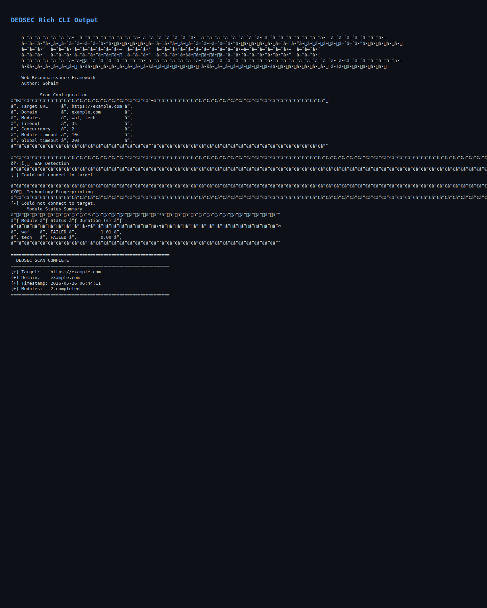

# DEDSEC — Web Reconnaissance Framework

[](https://www.python.org/)
[](LICENSE)

DEDSEC is a modular reconnaissance framework for authorized web security testing. It brings common recon tasks into a single CLI, including WAF fingerprinting, technology detection, DNS inspection, TLS analysis, port checks, subdomain discovery, and endpoint extraction.

## Features

| # | Module | Description |
|---|---|---|
| 1 | WAF Detection | Detects 12+ WAFs with confidence scoring and trigger payloads |
| 2 | Tech Fingerprinting | Languages, servers, CMS, JS frameworks, CDN, analytics |
| 3 | DNS Recon | A/AAAA/MX/NS/TXT/CNAME/SOA records + zone transfer attempt |
| 4 | IP & GeoLocation | IP resolve + country, city, ISP, ASN via ip-api.com |
| 5 | SSL/TLS Analysis | Cert expiry, SANs, protocol version, serial number |
| 6 | Header Audit | 12 security headers check + information disclosure detection |
| 7 | Open Redirect | Tests 15 common redirect parameters for open redirect |
| 8 | Robots & Sitemap | Parses robots.txt + probes common sitemap URLs |
| 9 | Cookie Audit | HttpOnly, Secure, SameSite flag checks with risk explanations |
| 10 | Port Scan | Top 25 ports via concurrent scanning with service names |
| 11 | WHOIS Lookup | Registrar, dates, nameservers, org, country |
| 12 | Subdomain Enum | Passive via crt.sh Certificate Transparency (up to 50) |
| 13 | JS & Endpoint Extraction | JS files, API endpoints, email addresses from page source |

## Installation

```bash
git clone https://github.com/muhammadsohaimmuqtada/dedsec.git
cd dedsec
pip install -e .
```

Or install dependencies manually:

```bash
pip install -r requirements.txt
```

## Usage

**Scan all modules:**
```bash
dedsec https://example.com
```

**Run specific modules:**
```bash
dedsec https://example.com --modules waf ssl headers dns
```

**Tune safe performance limits:**
```bash
dedsec https://example.com --concurrency 6 --timeout 12 --module-timeout 20 --global-timeout 90 --retries 3 --backoff 0.5
```

**JSON output:**
```bash
dedsec https://example.com --json
```

**Save report to file:**
```bash
dedsec https://example.com --output report.json --json
```

**Backward-compatible thread flag (maps to --concurrency):**
```bash
dedsec https://example.com --threads 5
```

**Run via Python module:**
```bash
python -m dedsec https://example.com
```

### Rich Terminal UI Example

```text
                                Scan Configuration
┏━━━━━━━━━━━━━━━━┳━━━━━━━━━━━━━━━━━━━━━━━━━━━━━━━━━━━━━━━━━━━━━━━━━━━━━━━━━━━━━━━━━━━┓
┃ key            ┃ value                                                             ┃
┡━━━━━━━━━━━━━━━━╇━━━━━━━━━━━━━━━━━━━━━━━━━━━━━━━━━━━━━━━━━━━━━━━━━━━━━━━━━━━━━━━━━━━┩
│ Target URL     │ https://example.com                                               │
│ Domain         │ example.com                                                       │
│ Modules        │ waf, tech, dns, geo, ssl                                         │
│ Timeout        │ 10s                                                               │
│ Concurrency    │ 5                                                                 │
└────────────────┴───────────────────────────────────────────────────────────────────┘

                              Module Status Summary
┏━━━━━━━━━━━┳━━━━━━━━━┳━━━━━━━━━━━━━━┓
┃ Module    ┃ Status  ┃ Duration (s) ┃
┡━━━━━━━━━━━╇━━━━━━━━━╇━━━━━━━━━━━━━━┩
│ waf       │ SUCCESS │         1.20 │
│ tech      │ SUCCESS │         0.44 │
│ dns       │ TIMEOUT │        20.00 │
└───────────┴─────────┴──────────────┘
```



### All Options

```text
usage: dedsec [OPTIONS] URL

positional arguments:
  url              Target URL (e.g., https://example.com)

options:
  --modules, -m        Modules to run (repeatable). Supports `all`
  --timeout            Base request timeout in seconds (default: 10)
  --concurrency        Bounded parallel module concurrency (default: 5)
  --threads            Backward-compatible alias for --concurrency
  --module-timeout     Per-module timeout in seconds
  --global-timeout     Global scan timeout in seconds
  --retries            HTTP retries with exponential backoff (default: 3)
  --backoff            Retry backoff factor (default: 0.5)
  --output             Save report to JSON file
  --json               Print JSON report to stdout
  --market             Run curated high-signal module profile
  --version            Show version and exit
```

## Requirements

- Python 3.8+
- `requests==2.32.3`
- `dnspython==2.6.1`
- `python-whois==0.9.5`
- `rich==13.9.4`
- `typer==0.12.5`

## Legal Disclaimer

> For authorized testing only. Obtain explicit written permission before scanning systems you do not own.

## Author

Sohaim Muqtada
